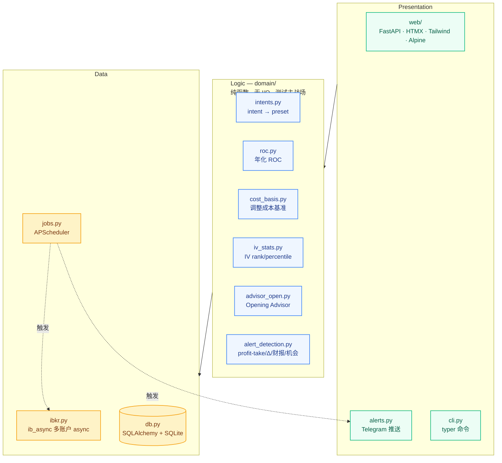
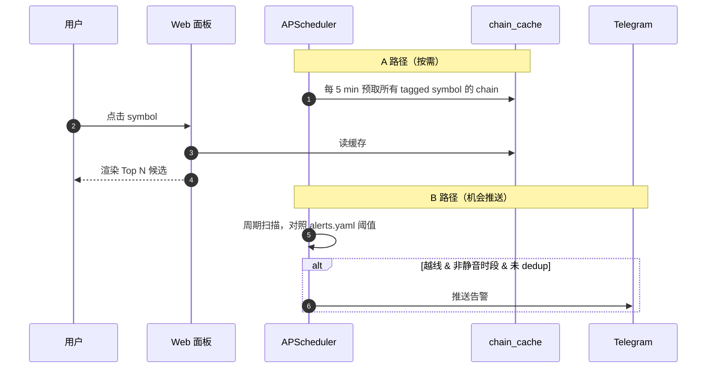

# AGENTS.md — 给未来 Codex 会话的项目上下文

这份文件让 Codex 在新会话里不必从零探索代码就能上手。

## 项目是什么

一个本地化的 Interactive Brokers 期权辅助工具。用户（Patrick）有 **两个 IBKR
账户**，IB Gateway 跑在 `127.0.0.1:4001`（只读）。主策略是对持仓写
covered call (CC)，对 watchlist 写 cash-secured put (CSP)。

工具定位是 **decision-support，不自动下单**。它在 user-declared intent 的
框架内排出候选合约；用户自己去 TWS 点 "Open"。

## 三层架构

依赖方向：**Presentation → Logic → Data**。Logic 层禁止 import IBKR 或 DB
session（用 dataclass 传值），所以单测无需真实环境。

## Intent 模型（核心抽象）

每只 tracked symbol 打一个 intent。每个 intent 在 `config/intents.yaml` 里
带一组 filter preset；Opening Advisor 先用 preset 过滤合约，再按 intent 偏好
的指标（通常是年化 ROC）排序。

| Intent        | CC/CSP | Filter preset                                          |
| ------------- | ------ | ------------------------------------------------------ |
| `CORE_HOLD`   | 无     | 完全不进扫描                                            |
| `INCOME`      | CC     | Delta ≤ 0.20，DTE 30–45，按年化 ROC 排序                |
| `TRADE`       | CC     | Delta 0.25–0.35，DTE 7–21，按绝对 premium 排序           |
| `WANT_TO_OWN` | CSP    | strike ≤ target_buy_price，Delta ≤ 0.30，DTE 21–45      |
| `WATCH`       | 无     | 仅做价格 + 财报跟踪                                      |

**全局硬规则**：所有 intent 都排除 DTE 跨财报的合约。**没有** `IV_HARVEST`
intent —— Patrick 明确不赌财报。

`wheel_enabled` 是 per-symbol 的修饰符（不是单独的 intent）。语义上：CSP
被接应 → `INCOME`；CC 被行权 → `WANT_TO_OWN`。**auto-flip 已实现**：
`sync_positions` 对比两次 snapshot，用 ``domain/wheel.detect_assignments``
识别到 assignment 后，``_apply_wheel_flips`` 更新 ``Symbol.intent``；
CC 被行权翻到 WANT_TO_OWN 时，若 ``target_buy_price`` 未设，默认取被行权
的 strike，避免新 intent 静默 unscannable。

## 触发模型：A + B 混合

- **A（按需）**：cache 5 min 刷新一次，点击体感秒开。
- **B（机会推送）**：阈值包括 IV spike、已开仓 Delta 危险、财报冲突、
  机会 ROC > 阈值。
- 静音：22:00–07:00 本地时间；dedup key 防重复。

## Recommendation 日志

每次 surface 给用户的 recommendation（CLI 或 Web）都写入 `recommendations`
表，`taken=False` 默认。未来分析："我没采纳的 Top-1 候选里，多少%本来是
盈利的？" 这是校准 scoring function 的反馈环。

## Telegram

已就绪。Bot token + chat_id 放 `.env`（**不进** YAML，可用 `TELEGRAM_BOT_TOKEN`
/ `TELEGRAM_CHAT_ID` 裸名或加 `OPTIONS_TOOL_` 前缀）。`alerts.py` 负责分发；
`alerts.yaml` 定义阈值。env 缺失时 graceful degrade —— 打 warning，不 crash。
4 类 detector 已实现：profit-take 50/80%、Delta 危险、财报冲突、机会 ROC。
22:00–07:00 静音，critical 等级例外；同 alert_key 在 dedup 窗口内不重发。

## 财报数据

已就绪。Finnhub 免费档每次 sync-positions 顺带刷新；旧的过期日期不动，未来
日期按 symbol 全量替换。`config/intents.yaml` 的 `exclude_earnings_dte` 是
所有 intent 共用的硬规则。**不用** Yahoo 抓取。

## IV 历史

已就绪。表 `iv_history` 由 `sync_iv_history` 通过 ib_async
`reqHistoricalData(whatToShow="OPTION_IMPLIED_VOLATILITY")` 拉，**首次自动
1 年回填，之后增量 10 天**。每个工作日 22:00 UTC 自动跑。`domain/iv_stats.py`
对 trailing window（默认全量，目标 252 交易日 ≈ 1 年）算 IV rank / percentile，
在详情页头部 IVR/IVP badge 显示。

> 早期计划过"从零累积 60 天"，后来发现 IBKR `reqHistoricalData` 直接给历史
> 即可，省事 6 周。

## 多账户

`config/accounts.yaml` 列出一个或多个 `(host, port, client_id, account_code,
alias)`。多账户场景下，第二个账户由另一个 Gateway 实例在不同端口提供。
代码必须支持并发多连接（每条 entry 一个 `IB()` 实例）。

## 测试策略

- `tests/domain/` —— 纯单测，无 I/O，覆盖率主战场。
- `tests/`（根目录）—— 轻量集成测试，临时 SQLite。
- IB Gateway 集成只手动验，跑 `scripts/test_ib_connect.py`，**不进 CI**
  （依赖在线 Gateway）。

## 约定

- 配置一律走 pydantic-settings 或 `config/` 下的 YAML。代码里不硬编码路径
  或 secret。
- domain/ 函数只接受 primitive args + dataclass，**不接受** SQLAlchemy
  模型。这样可以脱离 DB 单测。
- `ib_async` 是 async-first。多账户/多 symbol fanout 用 `asyncio.gather`，
  同步代码里不要 block。
- SQLite 启动时启用 WAL mode，让 web 请求和 scheduler 写入并发不互锁。

## 状态（更新于 2026-04-23）

P0 + P1 + P2 + P3 第一批已收口：

- **Position Advisor**（``domain/advisor_position.py``）：每个开仓 short
  给 CLOSE / HOLD / ROLL / STOP_LOSS 建议。``PositionAdvice`` 除 label /
  reason / severity 外还带 ``dte / contracts / decay_pct / delta_abs /
  premium_open_total / current_value_total / pnl_unrealized /
  remaining_max_profit``，reason 文本里也加了 $ 金额。Web 详情页在 row
  下方加了 severity-颜色 banner 行显示 reason（不用 hover）。
- **Roll 模拟器**（``domain/roll_simulator.py``）：嵌在 Web 详情页（summary
  带 "最佳净 credit × 合约数" 的总金额），也有 CLI ``options-tool
  simulate-roll`` 可复用。
- **Recommendation 反馈环分析**（``domain/feedback_loop.py`` +
  CLI ``options-tool analyze-recommendations``）：读 ``recommendations``
  表里已到期的条目，用 ``stock_price_history`` 里的到期日收盘价算"当初
  如果开仓会赚多少"。支持 ``--skipped-only`` 聚焦"没采纳的 Top-N 本来
  盈利吗"这个校准问题。``--refresh`` 触发 ``sync_stock_closes_for_recs``
  按需拉 IB `reqHistoricalData(whatToShow="TRADES")`。按 intent / rank /
  symbol / taken 分桶统计 hit-rate 和 avg P&L。
- **Wheel intent 自动翻转**：见 intent 模型章节。
- **Expiry scenarios**（``domain/expiry_scenarios.py``）：每个 short 在
  详情页给 OOM / 被行权两种结局的有效价与兑现 P&L；CC 下面另附"下一轮
  CSP 候选"表（strike < CC strike 的 PUT），便于人工对比 roll vs
  assign+CSP。
- **Position-aware chain prefetch**：``jobs.prefetch_chains`` 除按 intent
  拉一侧外，还按每个开仓 short 的 ``(symbol, right, expiry+60d)`` 补拉，
  解决"WANT_TO_OWN 只缓存 PUT，open CC 的 Roll 无候选"的盲点。
- **CLI symbols 子命令**：``options-tool symbols list / set``，可改
  intent / target / wheel / weekly / hidden / notes（Web 也能做，CLI 是备选）。
- **Web UI missing-target 提示**：WANT_TO_OWN 但 target 未设时，symbol
  列表显示 ⚠，详情页显示 banner，点击可直接开编辑弹窗。
- **历史 fills 导入**：IBKR `reqExecutions` 只能拿当天，更早的需 Flex Web
  Service 或手工补（未做）。

未来（P3+）：

- Compound strategy comparator：目前是并排显示；未来可合并成 "roll
  net" vs "assign + next-CSP net" 的单值比较。
- 反馈环闭环：把 analyze-recommendations 的输出用来 tune scoring
  function（哪个 intent 的 rank-1 miss 率高？哪个 symbol 系统性地高估？）。
- 无限期延后：PMCC / collar / hedge intent。
