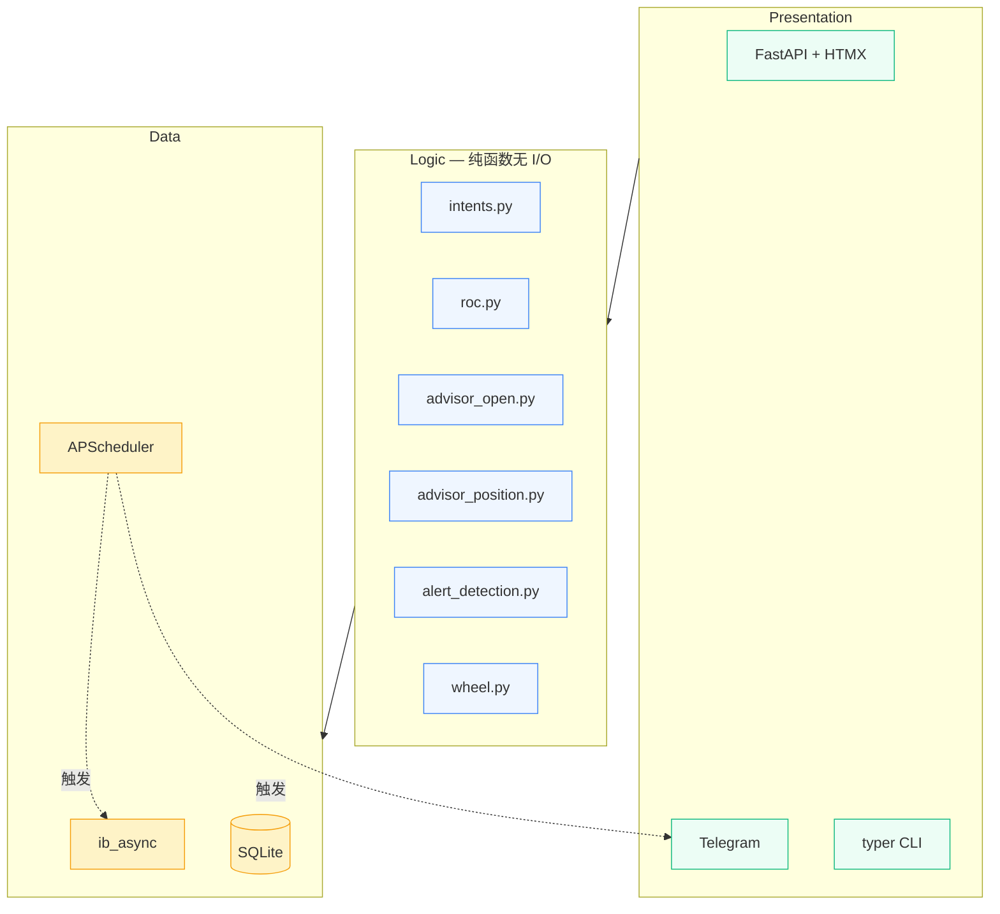

# options-tool

本地化的 Interactive Brokers 期权辅助决策工具。
你给每只股票打一个**意图标签**，工具按这个意图在期权链里选合约、排序、
在你已开仓后给提醒。

> ⚠️ **不会自动下单。** 所有建议都是文字，最终要不要点 "Open" 是你的事。
> 工具以**只读 API** 连接 IB Gateway——哪怕代码有 bug 也下不了单。

---

## 谁适合用

| 你是这种人 | 工具能帮你 |
|---|---|
| 长期持有底仓，想卖 covered call 收 premium 当租金 | 给 `INCOME` 意图，按年化 ROC 排序保守的远 OTM call |
| 短线波段卖 CC | 给 `TRADE` 意图，按绝对 premium 排序近月、Δ 略高的 call |
| 观察名单里有想低价接的票 | 给 `WANT_TO_OWN` 意图 + 目标价，按年化 ROC 排序 strike ≤ 目标价的 cash-secured put |
| 不想每次手动算财报冲突 / 年化 ROC | 工具硬规则排除跨财报合约，自动算年化 |

不适合：高频策略、PMCC、复杂 spread、量化回测。

---

## 快速开始（三步）

### 第一步：装并设置 IB Gateway

按 [docs/ib-gateway-setup.md](docs/ib-gateway-setup.md) 一步步装、登录、
开 API、加 Trusted IP `127.0.0.1`。**这是最容易卡住的一步，建议照着做。**

### 第二步：装本工具

打开终端，cd 到项目目录，跑：

```bash
bash scripts/install.sh
```

它会：装 Python 包管理器 `uv`（如没装）、装项目依赖、复制配置文件模板、
建本地 SQLite 数据库。

跑完会提示你下一步——编辑 `config/accounts.yaml`，把里面的 `UXXXXXXX`
改成你真实的 IBKR 账号代码（U 开头的那串，在 IB Gateway 主界面右上角能
看到）。

### 第三步：启动

确认 IB Gateway 已经登录，然后：

```bash
bash scripts/run.sh
```

浏览器打开 <http://localhost:8000>。第一次启动是空的，点右上角
**Sync IBKR** 按钮把当前持仓拉下来。

---

## 日常用法

### 加一只想跟踪的股票

左上角 **+ Add** → 填 ticker（比如 `NVDA`） → 选意图 → 保存。

| 意图 | 适用 |
|---|---|
| `INCOME` | 已经持有这只票的底仓 |
| `TRADE` | 持有底仓，想做短线 CC |
| `WANT_TO_OWN` | 没买，想低价接 |
| `WATCH` | 只跟踪股价 + 财报 |
| `CORE_HOLD` | 长期裸持，绝不卖期权 |

`WANT_TO_OWN` 必须填**目标价**，否则工具不会给建议。

### 看建议

左侧点击 symbol → 右侧详情页：

- **顶部**：股价、IV Rank、距下次财报天数
- **持仓**（如果有）：每张 short option 的当前 P&L、Δ、距到期、工具的
  CLOSE / HOLD / ROLL / STOP_LOSS 建议（颜色编码）
- **Top opportunities**：当前意图下排名前 5 的候选合约

看到喜欢的合约 → 自己去 TWS 点 "Open"。工具不会替你下单。

### Telegram 推送（可选）

编辑 `.env`，填：

```
OPTIONS_TOOL_TELEGRAM_BOT_TOKEN=...
OPTIONS_TOOL_TELEGRAM_CHAT_ID=...
OPTIONS_TOOL_FINNHUB_API_KEY=...
```

不填也能用，工具会 graceful 降级，不影响 Web 面板。

详细推送规则见 [规则手册](docs/规则手册.md#5-telegram-提醒规则)。

---

## 想改阈值

**Web 面板里能改的**（即时生效）：
- 某只 symbol 的意图 / 目标价 / Wheel / 备注

**改 yaml 文件**（要重启）：
- `config/alerts.yaml` — Δ 警戒值、止损倍数、安静时段、去重窗口、ROC 阈值
- `config/intents.yaml` — 各意图的 Δ / DTE / 排序口径

完整规则和默认值见 [docs/规则手册.md](docs/规则手册.md)。

---

## 故障排查

| 现象 | 原因 / 解决 |
|---|---|
| `Connection refused` 报错 | IB Gateway 没开或没登录。先去开 |
| Web 面板能开但 Sync IBKR 卡住 | API 没勾 "Enable ActiveX and Socket Clients"，回 [setup](docs/ib-gateway-setup.md#3-配置-api关键步骤) |
| `clientId X is already in use` | 别的程序占了同一个 client_id。改 `config/accounts.yaml` 里 `client_id: 7878` 换一个值，比如 `7980` |
| 添加 symbol 报"IBKR 找不到 XXX" | ticker 拼错了，或者 IBKR 没这个标的的市场数据订阅 |
| 期权链一直空 | 等 5 分钟（chain 缓存的预取周期），或者点 symbol 详情页的 **Run advisor** 按钮强制拉一次 |
| Telegram 推送没收到 | 检查 `.env` 里 `TELEGRAM_BOT_TOKEN` 和 `TELEGRAM_CHAT_ID`；可以跑 `uv run options-tool test-telegram "ping"` 测试 |

---

## 进阶

### CLI 命令

Web 面板覆盖大部分日常操作，但 CLI 在脚本化和 debug 时方便：

```bash
uv run options-tool init-db                 # 建表
uv run options-tool sync-positions          # 拉持仓 + 财报
uv run options-tool sync-iv-history         # 1 年 IV 回填（首次必跑）
uv run options-tool sync-transactions       # 拉当天 fills
uv run options-tool scan-alerts             # 手动跑一次告警扫描
uv run options-tool test-telegram "ping"    # 验 Telegram
uv run options-tool simulate-roll URA --right P --strike 30 --expiry 2026-05-16
uv run options-tool analyze-recommendations --skipped-only
uv run options-tool symbols list
uv run options-tool symbols set NVDA --intent INCOME --wheel
```

### 多账户

`config/accounts.yaml` 支持多 entry，每个账户用独立 IB Gateway 实例（端口
不同）。复制示例里第二段的注释取消掉，填进去就行。

### 架构



依赖方向：Presentation → Logic → Data。Logic 层是纯函数（不 import IBKR /
DB），单测覆盖率主战场（170 个单测）。

更多设计细节见 [CLAUDE.md](CLAUDE.md)（架构 / 模块图 / 决策记录）和
[docs/SCHEMA.md](docs/SCHEMA.md)（数据库 schema）。

---

## License

个人使用。不附带任何投资建议——所有期权交易决定由你自负。
