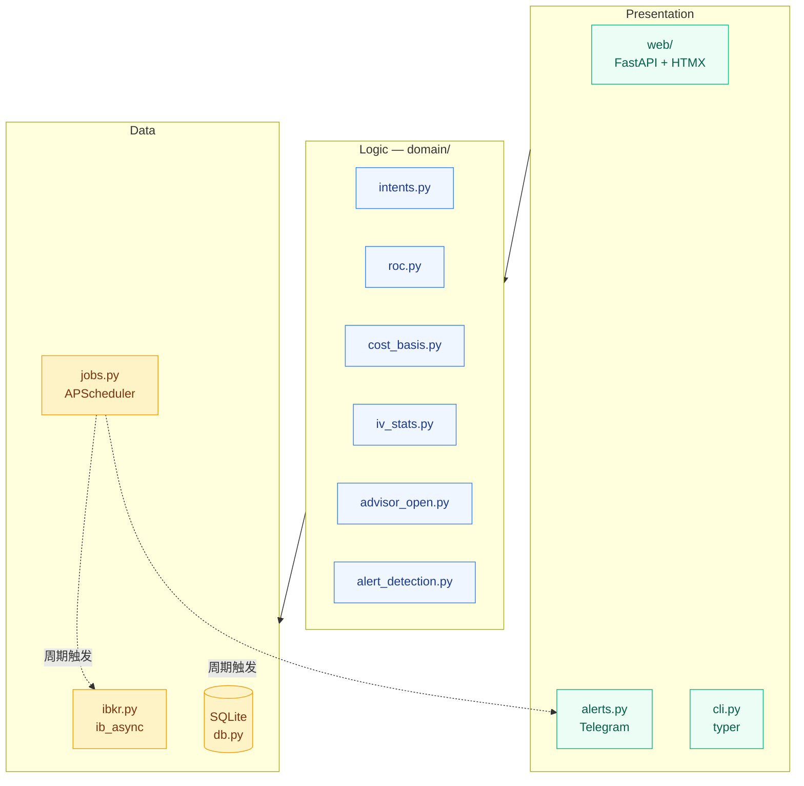
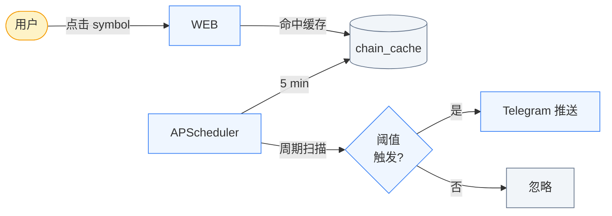

# options-tool

本地化的 Interactive Brokers 期权辅助决策工具。在你为每只股票声明的 **intent**
（持有意图）框架下，对 covered call (CC) 和 cash-secured put (CSP) 候选合约做
量化排序。

工具 **不自动下单**。它以只读方式连接 IB Gateway，把 positions / transactions
持久化到本地 SQLite，并提供一个简洁的 Web 面板和 Telegram 机会推送。

## 为什么自己写

IBKR 自带前端按 raw premium / 买卖价排序期权链，但它不知道：

- 哪些是你 **打死不卖** 的核心持仓
- 哪些是你想做 **短线套利**、可以接受激进 Delta 的票
- 哪些是观察名单里你愿意在 **目标价以下** 用 CSP 接盘的票
- 当前合约到期日是不是 **跨财报**

这个工具把上述意图编码成 per-symbol 的 intent 标签，在你给定的边界内
排序合约。决策权仍在你手里 —— 工具只回答："给定我对这只票的 intent，
今天最划算的合约是哪几张？"

## 架构总览



## 状态

P0 + P1 完成。具体已交付：IBKR 多账户同步、Opening Advisor、adjusted cost
basis、Finnhub 财报日历、IV 历史 + IV rank/percentile、Telegram 机会推送、
APScheduler 自动化（chain prefetch / alerts / daily IV / daily fills）。

下一档 P2：Position Advisor（Close/Hold/Roll）、wheel intent 自动翻转、
Flex Web Service 历史 fills 导入。

详见 [docs/SCHEMA.md](docs/SCHEMA.md)（数据模型）和 [CLAUDE.md](CLAUDE.md)
（架构 / 模块图 / 设计决策）。

## 安装

前置：Python 3.12+（用 `uv` 管理），IB Gateway 跑在 `127.0.0.1:4001`，
本机装好 `uv`。

```bash
uv sync                                     # 装依赖到 .venv
cp config/accounts.yaml.example config/accounts.yaml
$EDITOR config/accounts.yaml                # 填 account code
uv run options-tool init-db                 # 建 SQLite 表
uv run options-tool sync-positions          # 从 IBKR 拉当前持仓 + 财报
uv run options-tool sync-iv-history         # 1 年 IV/HV 回填（首次必跑）
uv run options-tool serve                   # 启 Web 面板（localhost:8000）
```

日常用 Web 面板就够。其余 CLI 命令（debug / 一次性任务）：

```bash
uv run options-tool sync-transactions       # 拉当天 fills（scheduler 已每天跑）
uv run options-tool scan-alerts             # 手动跑一次告警扫描
uv run options-tool test-telegram "ping"    # 验 token / chat_id
```

Telegram 配置（可选）：在项目根放 `.env`：

```
TELEGRAM_BOT_TOKEN=...
TELEGRAM_CHAT_ID=...
FINNHUB_API_KEY=...
```

## Intent 标签

每只 tracked symbol 带一个 intent 标签，决定 scanner 行为：

| 标签           | 含义                                  | Scanner 行为                                       |
| ------------- | ------------------------------------- | ------------------------------------------------ |
| `CORE_HOLD`   | 长期持有，绝不卖期权                    | 完全不出现在扫描结果里                             |
| `INCOME`      | 持有收租（covered call）               | 保守：Delta ≤ 0.20，DTE 30–45，深度 OTM           |
| `TRADE`       | 短线套利 covered call                   | 激进：Delta 0.25–0.35，DTE 7–21                  |
| `WANT_TO_OWN` | 观察票，愿在目标价接盘（CSP）           | strike ≤ target，按年化 ROC 排序                  |
| `WATCH`       | 只盯价格 + 财报                        | 不出建议；仅 price + earnings 跟踪                 |

可选 `wheel` 修饰符：标记这只票走 wheel 策略。**flag 已存 DB，但 assignment
触发的自动翻转逻辑还没实现**（P2 待办）—— 现在被 assign 后需手工改 intent。

**财报红线。** 所有 scanner 都会排除 DTE 跨财报日的合约。这是硬规则，
没有 opt-out。

## 触发模型：A + B 混合



- **A（按需）**：用户点开一个 symbol，advisor 读取缓存的 chain，渲染
  Top N。Cache 由 scheduler 每 5 分钟刷新一次，所以点击体感秒开。
- **B（机会推送）**：scheduler 周期扫描所有 tagged symbols，越过阈值
  （IV spike / 已开仓 Delta 危险 / 财报冲突 / ROC 高）就 Telegram 推送。

22:00–07:00 静音；dedup key 防止重复推送。

## 目录结构

```
src/options_tool/
  ibkr.py            IB Gateway 适配（ib_async）
  db.py              SQLAlchemy 模型 + session
  sync.py            positions / orders / earnings / IV / fills 同步
  alerts.py          Telegram 分发 + 静音/dedup
  advisor.py         Opening Advisor 编排（chain 拉取 + 缓存）
  jobs.py            APScheduler：chain prefetch / 告警扫描 / daily IV / daily fills
  finnhub.py         财报日历客户端
  settings.py        pydantic-settings 入口
  domain/            纯逻辑层 —— 不依赖 IBKR 或 DB，可单测
    intents.py       intent → 过滤预设
    roc.py           年化 ROC 公式
    cost_basis.py    premium-adjusted 成本基准
    iv_stats.py      IV rank / percentile
    advisor_open.py  filter + rank chain
    alert_detection.py  profit-take / Δ 危险 / 财报冲突 / 机会
  web/               FastAPI + HTMX 模板
  cli.py             typer 入口
config/
  intents.yaml         per-intent 过滤预设
  accounts.yaml        IB Gateway 连接配置（多账户）
  alerts.yaml          告警阈值 + 静音时段
data/
  options.db       SQLite（gitignored）
docs/
  SCHEMA.md        数据库 schema 参考
```

## License

个人使用。
