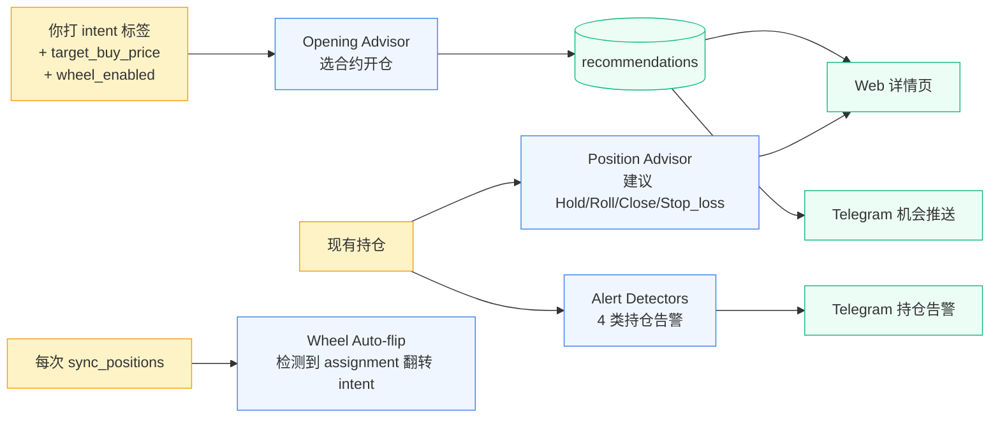

# 系统规则手册

这份文档把工具里所有的判断规则、阈值、公式集中列出来——一份学习用的速查表。
真正的"事实"在代码里，这里只是把代码翻译成可读的中文。任何冲突以代码为准。

每条规则末尾都标了实现位置 `(file.py:func)`，方便你想深挖时直接跳过去。

## 0. 规则分层与触发顺序



下面按这条线一节一节讲。

---

## 1. Intent 模型（你给标的打的标签）

每只 tracked symbol 必须有一个 intent。Intent 决定 **要不要扫**、**用哪套规则扫**。

| Intent          | 是否扫描 | 卖什么     | 给谁看                              |
| --------------- | -------- | ---------- | ----------------------------------- |
| `INCOME`        | 是       | CC（卖看涨）| 已持有底仓，想收 premium 当租金     |
| `TRADE`         | 是       | CC          | 短线波段 CC，吃近月时间价值          |
| `WANT_TO_OWN`   | 是       | CSP（卖看跌）| 想低价接应，没接到也吃 premium     |
| `CORE_HOLD`     | 否       | 不卖       | 长期裸持，不参与卖权                |
| `WATCH`         | 否       | 不卖       | 只跟踪股价 + 财报                   |

`wheel_enabled` 是 per-symbol 修饰符（不是单独的 intent）：开启后 assignment
事件会自动翻转 intent（详见 §6）。

**实现**：`config/intents.yaml`、`domain/intents.py:SCANNABLE_INTENTS`

---

## 2. Opening Advisor —— 开仓选合约

### 2.1 五个 intent 的 filter preset

| Intent        | 方向 | Δ 范围        | DTE 范围 | strike 限制                | 排序           |
| ------------- | ---- | ------------- | -------- | -------------------------- | -------------- |
| `INCOME`      | CALL | ≤ 0.20        | 25–55    | 取 spot ±40% 范围 30 strikes | 年化 ROC ↓     |
| `TRADE`       | CALL | 0.25–0.35     | 7–21     | 取 spot ±15% 范围 12 strikes | 绝对 premium ↓ |
| `WANT_TO_OWN` | PUT  | ≤ 0.30        | 25–55    | strike ≤ target_buy_price  | 年化 ROC ↓     |
| `CORE_HOLD`   | —    | 不扫描         | —        | —                          | —              |
| `WATCH`       | —    | 不扫描         | —        | —                          | —              |

> DTE 25–55 这个窗口是为了**保证一定能捕到下一个第三周五月权**，不论今天是
> 月初还是月末。

### 2.2 全局硬规则（不可在 yaml 里关）

| 规则                                          | 为什么                                              |
| --------------------------------------------- | --------------------------------------------------- |
| 跨财报的 DTE 一律排除                          | 你明确不赌财报，这是项目立场                          |
| 默认只扫月权（第三周五），除非 `weekly_ok=True` | 周权流动性差；只有 SPY/NVDA 这类大票才适合开周权     |
| bid 和 ask 必须都 > 0                          | 没活报价 = 不可执行，否则推荐了也没用               |
| `WANT_TO_OWN` 没设 `target_buy_price` → 全过滤掉 | 配置错误时让问题显眼，不要默默给烂 CSP             |
| 缺 Δ 的合约**保留**，不淘汰                    | 不能因为数据缺失就罚——只是排序会落后                |

**实现**：`domain/intents.py:filter_chain`

### 2.3 排序规则

- `INCOME` / `WANT_TO_OWN` → 按 **年化 ROC** 降序（追求资本效率）
- `TRADE` → 按 **绝对 premium** 降序（短线只看真金白银，年化噪音大）

### 2.4 ROC 公式

```
CC 年化 ROC = (premium / underlying_price) × (365 / DTE)
CSP 年化 ROC = (premium / strike) × (365 / DTE)
```

CC 用现价（机会成本：股票本身的资本占用）；CSP 用 strike（保证金按 strike
冻结）。两者本质都是 **每股 premium / 每股资本**。

**实现**：`domain/roc.py`

### 2.5 输出

每个 intent 取 top 5（`top_n: 5`）写进 `recommendations` 表。表顶 rank-1
进入仪表盘 "Top opportunities"；满足 `roc_threshold_annual`（默认 40%）进 Telegram。

---

## 3. Position Advisor —— 现有持仓建议

对每个**未到期的 short option leg**，按下面这张优先级表从上到下匹配，
**先匹配的先返回**——不会同时给两条建议。

| 优先级 | 触发条件                                         | Label       | 严重度    | 颜色  |
| ------ | ------------------------------------------------ | ----------- | --------- | ----- |
| 1      | 财报落在 (今天, 到期] 内 或 距到期 ≤ 7 天        | `ROLL`      | warn      | 琥珀  |
| 2      | 当前 mark 已衰减 ≥ 80%（PROFIT_80）               | `CLOSE`     | info      | 翠绿  |
| 3      | 当前 mark ≥ 2× 开仓 premium（STOP_LOSS）          | `STOP_LOSS` | warn      | 橙    |
| 4      | \|Δ\| ≥ 0.50（DELTA_CRIT）                       | `ROLL`      | critical  | 玫红  |
| 5      | mark 衰减 ≥ 50% **且** DTE ≤ 7                   | `CLOSE`     | info      | 翠绿  |
| 6      | \|Δ\| ≥ 0.40 **且** DTE ≤ 7（DELTA_WARN）         | `ROLL`      | warn      | 琥珀  |
| 7      | 都不满足                                          | `HOLD`      | info      | 灰    |

### 关键设计选择

- **STOP_LOSS 排在 DELTA_CRIT 上**：mark 翻倍意味着损失已超出标准风险预算，
  这时再 roll 出去收个小 credit 是搬椅子，不是修船。给你独立 label 而不是
  CLOSE，因为产品语义是"你在亏，自己决定"，不是"漂亮利润锁定"。
- **PROFIT_50 / DELTA_WARN 加了 DTE ≤ 7 闸门**：长 DTE 的 50% 利润不急着
  关，让它继续衰减；长 DTE 的中等 Δ 也还没到必须动手的程度。
- **POSITION 建议是文字，不下单**：永远不会自动 roll/close，工具只给量化
  理由，决定权在你。

**实现**：`domain/advisor_position.py:advise_position`

---

## 4. Alert 检测器 —— Telegram 推送

7 类 detector，每次 `scan_alerts` 跑（默认 10 min/次）评估一遍所有 short legs。

### 4.1 持仓告警（4 类）

| alert_type          | 触发                                                       | 严重度    | 静音时段是否推 |
| ------------------- | ---------------------------------------------------------- | --------- | -------------- |
| `PROFIT_50`         | 短期权 mark 衰减 ≥ 50%                                       | info      | 否             |
| `PROFIT_80`         | 衰减 ≥ 80%（80 触发时不再发 50）                              | info      | 否             |
| `DELTA_WARN`        | \|Δ\| ≥ `delta_warning`（0.40）                              | warn      | 否             |
| `DELTA_CRIT`        | \|Δ\| ≥ `delta_critical`（0.50）（critical 触发时不再发 warn）| critical  | **是**         |
| `STOP_LOSS`         | mark ≥ `stop_loss_multiplier` × 开仓 premium（默认 2.0）     | warn      | 否             |
| `EARNINGS_CONFLICT` | 财报落在 (今天, 到期] 或距到期 ≤ 7 天                        | warn      | 否             |

### 4.2 机会告警

| alert_type    | 触发                                                       | 严重度 |
| ------------- | ---------------------------------------------------------- | ------ |
| `OPPORTUNITY` | Opening Advisor rank-1 候选年化 ROC ≥ `roc_threshold_annual`（0.40）| info |

### 4.3 Delta 告警自动附 roll 建议

`DELTA_WARN` 和 `DELTA_CRIT` 触发时，scan_alerts 会自动跑 roll simulator，
把 top-1 候选拼到消息末尾：

```
🔴 ZZSMOKE P50 2026-05-04 Delta=0.55 触发 critical (0.50)
  → roll: P48 2026-06-01 (DTE 42, Δ 0.20, net +0.20)
```

只对 Delta 类附加；profit-take / earnings / stop-loss 这三类的合理动作不是
roll，附 roll 建议反倒会误导。

### 4.4 Dispatch 规则

| 规则             | 行为                                                                 |
| ---------------- | -------------------------------------------------------------------- |
| **静音时段**      | 22:00–07:00 本地时间不推 Telegram，但 alert 还是写进 DB；critical 例外 |
| **去重**          | 同一 `alert_key` 在 6 小时内不重发                                    |
| **alert_key 格式** | `{type}:{symbol}:{right}:{strike}:{expiry}` ——精确到合约              |
| **Telegram 缺失** | `.env` 里没 token / chat_id 时 graceful degrade，打 warning 不 crash |

**实现**：`domain/alert_detection.py`、`alerts.py:dispatch_alerts`、`config/alerts.yaml`

---

## 5. Roll 模拟器 —— 给 ROLL 建议算具体合约

只在两个时机跑：
1. Position Advisor 给出 ROLL 时，详情页展开 "Roll 候选" 折叠面板
2. Telegram DELTA 告警里的 top-1 自动附录

### 5.1 Filter 规则（每个 chain quote 跑一遍）

| 规则                                            | 为什么                                       |
| ----------------------------------------------- | -------------------------------------------- |
| `new_expiry > pos.expiry`                       | "Roll" 必须延期，不能换到更早的             |
| `new_right == pos.right`                        | P→P / C→C，不翻方向                         |
| CC：`new_strike >= pos.strike`                  | up-and-out 或 flat，不能 down                |
| CSP：`new_strike <= pos.strike`                 | down-and-out 或 flat，不能 up                |
| `\|new_Δ\| < delta_warning`（0.40）              | 不要 roll 出去立刻又触发 defense 告警         |
| `new_bid > 0`                                    | 没 bid = 不可执行                            |
| `7 ≤ new_DTE ≤ 60`                              | 太短没意义，太长不如直接开新仓               |

### 5.2 净 credit 估算（保守）

```
close_cost  = 现仓 ask          # 关仓按 ask 买回
open_credit = 新仓 bid          # 开仓按 bid 卖出
net_credit  = open_credit - close_cost
```

`net_credit` 可以是负数——simulator 只报 chain 允许什么，决定是否做净 debit
roll 是你的事。

### 5.3 排序

按 `net_credit` 降序，取 top 5。

**实现**：`domain/roll_simulator.py:simulate_rolls` + `format_roll_suggestion`

---

## 6. Wheel 自动翻转 —— 接应 / 行权时改 intent

每次 `sync_positions` 跑完，diff 前后两次快照，**两个信号必须同时满足**才
判定为 assignment：

```
信号 A：某 short option 在前一次快照里有，新快照里没了
信号 B：同账户、同 symbol 的股数变化方向匹配
        - CSP（short put）→ 股数 +100 × |contracts|
        - CC（short call） → 股数 -100 × |contracts|
```

### 6.1 触发动作

| 类型          | 翻成的 intent  |
| ------------- | -------------- |
| CSP 被接应    | `INCOME`       |
| CC 被行权     | `WANT_TO_OWN`  |

### 6.2 边界情况

- 单边信号都不算（option 消失但股数没动 = BTC / 过期作废 / 滚动）
- 只对 `wheel_enabled=True` 的 symbol 翻
- 跨账户隔离——A 账户的 assignment 不被 B 账户的股数干扰
- long leg（qty > 0）跳过——别人不会被行权到我们头上
- 触发后写日志 `🔄 wheel auto-flip: ...`，下一次 Opening Advisor 自动按新 intent 选合约

> 为什么不查 `reqExecutions`？IBKR 这个 API 只返回**当天**的 fill，
> assignment 经常晚一天才出现在 exec stream。Diff position 更可靠，只要两
> 次连续 sync 隔着 assignment 那一刻就能抓到。

**实现**：`domain/wheel.py:detect_assignments`、`sync.py:_apply_wheel_flips`

---

## 7. 价格 / mark 计算

| 场景                              | 公式                                                |
| --------------------------------- | --------------------------------------------------- |
| 期权 mark（chain_cache 用）        | `(bid + ask) / 2` 如果 bid > 0 且 ask > 0；否则 `last` |
| 股票 spot                          | IBKR `reqMktData` 直接读                             |
| WATCH/CORE_HOLD spot              | sentinel chain_cache 行（expiry = 1970-01-01）       |
| BTC 关仓估价（roll 模拟用）         | 现仓 ask（保守）                                      |
| STO 开仓估价（roll 模拟用）         | 新仓 bid（保守）                                      |
| Recommendation 的 premium          | `mid` 同期权 mark 公式                               |
| 调整后 cost basis                  | `raw_avg_cost − (净 premium 收入 / 持股数)`           |

**实现**：`domain/intents.py:FilterableQuote.mid`、`domain/cost_basis.py`

---

## 8. IV 指标

| 指标          | 公式                                              | 解读                                       |
| ------------- | ------------------------------------------------- | ------------------------------------------ |
| IV Rank       | `(current − low) / (high − low)`                  | 线性，对极值敏感（一次财报 spike 能压几个月） |
| IV Percentile | `count(prior days IV < current) / total prior`    | 分布，忽略极值                              |

**窗口**：默认目标 252 个交易日（≈ 1 年，覆盖 4 个财报周期，tastytrade /
ToS 约定）。实际首次回填 1 年，之后每天增量 10 天。

**UI 颜色档**：

| IVR 范围 | 颜色 | 含义                                    |
| -------- | ---- | --------------------------------------- |
| ≥ 70     | 玫红 | premium 贵，特别适合卖权                |
| 40–70    | 琥珀 | 中等                                    |
| < 40     | 灰   | premium 便宜，谨慎卖权                  |

**实现**：`domain/iv_stats.py:compute_stats`、`sync.py:sync_iv_history`

---

## 9. 财报数据

| 来源       | Finnhub free tier                                     |
| ---------- | ----------------------------------------------------- |
| 刷新时机   | 每次 `sync_positions` 顺带刷一次                       |
| 写入逻辑   | 旧的过期日期不动，未来日期按 symbol 全量替换           |
| 应用场景   | (1) Opening Advisor 排除跨财报 DTE  (2) Position Advisor `EARNINGS_CONFLICT` ROLL  (3) Telegram `EARNINGS_CONFLICT` |
| 冲突窗口   | `earnings_conflict_dte`（默认 7 天）—— 财报落在距到期 7 天内也算冲突 |

> 不用 Yahoo（不稳定，容易 ban IP）。

---

## 10. 调度任务表

所有 job 都在 `jobs.py:make_scheduler()` 里注册，跑在 APScheduler 的
AsyncIOScheduler（UTC 时区）。

| Job                          | 频率                          | 干什么                                              |
| ---------------------------- | ----------------------------- | --------------------------------------------------- |
| `prefetch_chains`            | 每 5 min                      | 把所有 scannable + 非 hidden symbol 的 chain 拉到 cache，让点击秒开 |
| `scan_alerts`                | 每 10 min                     | 跑全部 detector，dispatch Telegram                   |
| `daily_iv_update`            | 周一–周五 22:00 UTC           | 给 `iv_history` 增量 10 天                          |
| `daily_transactions_update`  | 周一–周五 21:00 UTC           | 抓当天 fills（IBKR 只给当天）                        |

间隔可在 `.env` / `OPTIONS_TOOL_*` 环境变量改：
- `CHAIN_PREFETCH_INTERVAL_MINUTES`（默认 5）
- `ALERT_SCAN_INTERVAL_MINUTES`（默认 10）

---

## 11. Recommendation 反馈环

每条 surfaced 给你的候选都进 `recommendations` 表，含 `outcome` 字段：

| outcome     | 触发                                          | 用途                                          |
| ----------- | --------------------------------------------- | --------------------------------------------- |
| `null`      | 默认（你没操作）                                | 中性                                          |
| `taken`     | 你点了"采纳"                                  | 未来 scoring backtest 的 positive sample      |
| `dismissed` | 你点了"忽略"                                  | 未来 scoring backtest 的 negative sample      |

未来分析问题：**我忽略的 top-1 候选里，有多少%本来到期是盈利的？**——这是
校准 advisor 排序公式的反馈环。需要先攒几周数据。

**实现**：`web/app.py:POST /recommendations/{id}/mark`

---

## 12. 默认阈值速查表

```yaml
# config/alerts.yaml
quiet_hours_start: "22:00"
quiet_hours_end:   "07:00"
dedup_window_hours: 6

profit_take_50: true
profit_take_80: true
delta_warning: 0.40
delta_critical: 0.50
stop_loss_multiplier: 2.0
earnings_conflict_dte: 7
roc_threshold_annual: 0.40
iv_spike_pct: 30.0          # （iv spike detector 暂未启用）
```

```yaml
# config/intents.yaml — 摘要
INCOME:      delta_max=0.20  dte=25-55  rank=annualized_roc
TRADE:       delta=0.25-0.35 dte=7-21   rank=premium_absolute
WANT_TO_OWN: delta_max=0.30  dte=25-55  rank=annualized_roc
```

```python
# 不在 yaml 里、写死在代码里的常量
SHORT_DTE_THRESHOLD = 7        # advisor_position.py — PROFIT_50 / DELTA_WARN 升级闸门
roll min_dte = 7               # roll_simulator.py
roll max_dte = 60              # roll_simulator.py
roll top_n = 5                 # roll_simulator.py
recommendation top_n = 5       # 每 intent
iv 窗口目标 = 252 交易日       # iv_stats.py
财报窗口 = 7 天                # 跨财报排除 + 冲突告警共用
spot sentinel epoch = 1970-01-01  # chain_cache spot-only 行的 expiry
```

---

## 13. 哪里没规则（明确不做的事）

为了避免你觉得"工具是不是漏了什么"，把项目立场也写下来：

- **不下单**：永远不会自动开仓 / 平仓 / roll。所有建议都是文字，你自己去 TWS 点。
- **不赌财报**：跨财报 DTE 一律排除，没有 IV_HARVEST intent。
- **不做 PMCC / collar / hedge**：明确推到 P3+，可能永远不做。
- **不抓 Yahoo / scrape**：Finnhub 一家就够。
- **不做 backtest**（暂时）：等 `recommendations.outcome` 攒够数据再说。
- **不自动调整 strike_window_pct / max_strikes_per_side**：固定值，你觉得不够就改 yaml。

---

## 14. 我想改个阈值，去哪改？

| 想改的东西                        | 文件                                |
| --------------------------------- | ----------------------------------- |
| Δ warn / critical / stop-loss 倍数 | `config/alerts.yaml`                 |
| 静音时段 / 去重窗口                 | `config/alerts.yaml`                 |
| 推送 ROC 阈值                       | `config/alerts.yaml`                 |
| Intent 的 Δ / DTE / 排序            | `config/intents.yaml`                |
| 某只 symbol 的 intent / target / wheel | Web UI 编辑或 `.../symbols/{s}` PATCH |
| Job 频率                            | `.env`                              |
| 调度时间（cron 表达式）             | `jobs.py:make_scheduler` 直接改     |
| Position Advisor 优先级 / 短 DTE 闸门 | `domain/advisor_position.py` 改代码 + 跑测试 |
| Roll DTE 上下限                     | `domain/roll_simulator.py:simulate_rolls` 默认参数 |
