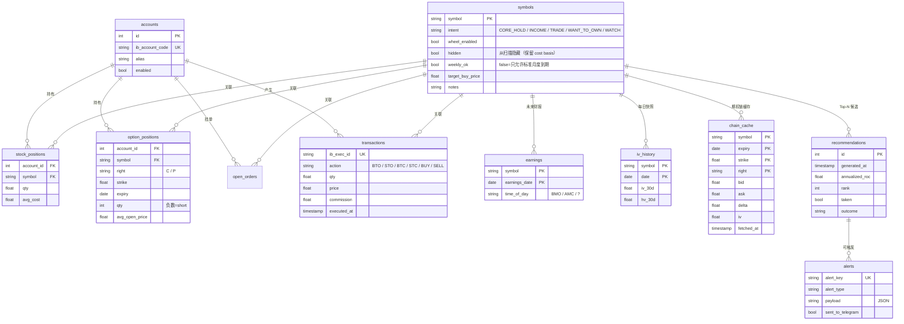
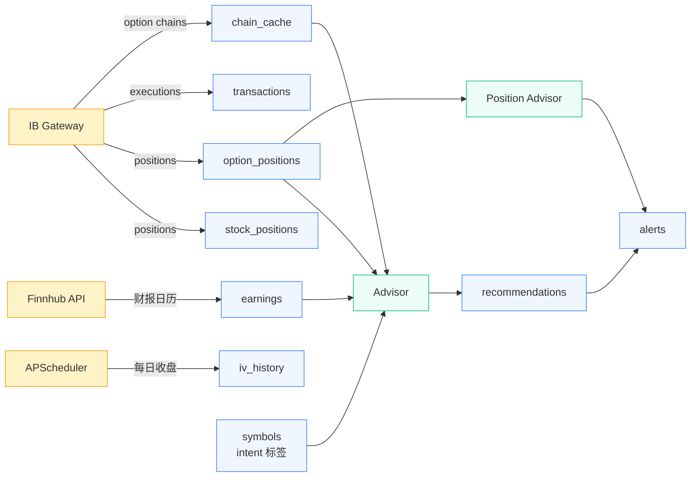

# 数据库 Schema

SQLite 数据库，路径 `data/options.db`，启用 WAL mode。

## 实体关系总览



## 数据流



## 表定义

### `accounts`

每个 IB 账户一行。

| 列                | 类型                  | 说明                         |
| ----------------- | -------------------- | ---------------------------- |
| `id`              | INTEGER PK           | 自增                          |
| `ib_account_code` | TEXT UNIQUE NOT NULL | 例如 `U1234567`               |
| `alias`           | TEXT                 | 友好名（`main`、`roth` 等）    |
| `enabled`         | BOOLEAN              | 不删除直接禁用的开关           |

### `symbols`

被跟踪股票的 universe，带 intent。手动通过 `options-tool tag SYMBOL INTENT`
维护。`CORE_HOLD` 不进 scanner，但 cost basis 还会算。

| 列                  | 类型                | 说明                                                |
| ------------------- | ------------------ | -------------------------------------------------- |
| `symbol`            | TEXT PK            | ticker，全大写                                      |
| `intent`            | TEXT NOT NULL CHECK | 五选一：CORE_HOLD/INCOME/TRADE/WANT_TO_OWN/WATCH    |
| `wheel_enabled`     | BOOLEAN            | wheel 标记（自动翻转逻辑 P2 待实现）                 |
| `hidden`            | BOOLEAN            | 从所有扫描隐藏；cost basis 仍计算                    |
| `weekly_ok`         | BOOLEAN            | false 时 advisor 只接受标准月度到期                  |
| `target_buy_price`  | REAL               | `WANT_TO_OWN` 必填                                  |
| `notes`             | TEXT               | 自由备注                                            |
| `updated_at`        | TIMESTAMP          | 自动                                                |

### `stock_positions`

每账户的股票持仓快照，由 IBKR sync 全量刷新。

| 列                | 类型              | 说明           |
| ---------------- | ---------------- | -------------- |
| `id`             | INTEGER PK       |                |
| `account_id`     | FK → accounts    |                |
| `symbol`         | TEXT             |                |
| `qty`            | REAL             | 股数            |
| `avg_cost`       | REAL             | 单股成本        |
| `market_value`   | REAL             |                |
| `last_synced_at` | TIMESTAMP        |                |
| UNIQUE(account_id, symbol) |        |                |

### `option_positions`

每账户的开仓期权合约。short 仓 `qty < 0`。由 IBKR sync 全量刷新。

| 列                | 类型              | 说明                                              |
| ---------------- | ---------------- | ------------------------------------------------ |
| `id`             | INTEGER PK       |                                                  |
| `account_id`     | FK → accounts    |                                                  |
| `symbol`         | TEXT             | 标的                                              |
| `right`          | TEXT             | `C` 或 `P`                                        |
| `strike`         | REAL             |                                                  |
| `expiry`         | DATE             |                                                  |
| `qty`            | INTEGER          | short 时为负                                       |
| `avg_open_price` | REAL             | 单股价（× 100 = 实际美元 premium）                  |
| `opened_at`      | TIMESTAMP        | 能 join 到最早 fill 时填                           |
| `current_value`  | REAL             | mark-to-market，跟着 chain 拉刷新                  |
| `current_delta`  | REAL             |                                                  |
| `current_iv`     | REAL             |                                                  |
| `last_synced_at` | TIMESTAMP        |                                                  |
| UNIQUE(account_id, symbol, right, strike, expiry) |     |                                  |

### `open_orders`

挂单未成交快照。每次 `sync-positions` 全量替换 per-account（cancel 后会消失）。
仅供 Web 详情页展示，advisor 不消费。

| 列                | 类型              | 说明                                              |
| ---------------- | ---------------- | ------------------------------------------------ |
| `id`             | INTEGER PK       |                                                  |
| `account_id`     | FK → accounts    |                                                  |
| `perm_id`        | INTEGER          | IBKR 持久订单 ID                                  |
| `symbol`         | TEXT             |                                                  |
| `asset_type`     | TEXT             | `STOCK` / `OPTION`                                |
| `right`          | TEXT             | option only                                       |
| `strike`         | REAL             | option only                                       |
| `expiry`         | DATE             | option only                                       |
| `action`         | TEXT             | `BUY` / `SELL`                                    |
| `order_type`     | TEXT             | `LMT` / `MKT` / `STP` / ...                       |
| `qty`            | REAL             |                                                  |
| `lmt_price`      | REAL             |                                                  |
| `aux_price`      | REAL             | stop / trail aux                                  |
| `status`         | TEXT             | `Submitted` / `PreSubmitted` / ...                |
| `last_synced_at` | TIMESTAMP        |                                                  |

### `transactions`

只增不删的成交流水，是 adjusted cost basis 计算的唯一可信源。靠
`ib_exec_id` 去重。

| 列                | 类型              | 说明                                              |
| ---------------- | ---------------- | ------------------------------------------------ |
| `id`             | INTEGER PK       |                                                  |
| `ib_exec_id`     | TEXT UNIQUE      | 来自 IBKR 的 dedup key                            |
| `account_id`     | FK               |                                                  |
| `symbol`         | TEXT             |                                                  |
| `asset_type`     | TEXT             | `STOCK` 或 `OPTION`                               |
| `action`         | TEXT             | `BTO`/`STO`/`BTC`/`STC`/`BUY`/`SELL`              |
| `right`          | TEXT             | 股票为 NULL                                        |
| `strike`         | REAL             | 股票为 NULL                                        |
| `expiry`         | DATE             | 股票为 NULL                                        |
| `qty`            | REAL             |                                                  |
| `price`          | REAL             | 单股价                                             |
| `commission`     | REAL             | 绝对值，含费用                                      |
| `executed_at`    | TIMESTAMP        |                                                  |
| `notes`          | TEXT             |                                                  |

**Cost basis 公式**（实现在 `domain/cost_basis.py`，可单测）：

```
net_premium  = Σ (sell_legs.qty × price × 100)
             - Σ (buy_legs.qty × price × 100)
             - Σ commission
adj_per_share = raw_avg_cost - (net_premium / shares_held)
```

`raw_avg_cost` 取 IBKR 报告的 `stock_positions.avg_cost`（IBKR 是真源），
我们只在它基础上扣已收的 net option premium。

**同步窗口陷阱**：IBKR `reqExecutions` API 只返回**当天**的 fill。早于今天
的成交无法回填 —— 要么靠 daily cron 持续累积（每天 21:00 UTC 自动跑，见
`jobs.daily_transactions_update`），要么走 Flex Web Service 一次性导出
（P2 待办），要么手工 INSERT。

### `earnings`

财报日历，每个 symbol 多行（按时间累积）。

| 列                | 类型         | 说明                                  |
| ---------------- | ----------- | ------------------------------------- |
| `symbol`         | TEXT        | 复合 PK                                |
| `earnings_date`  | DATE        | 复合 PK                                |
| `time_of_day`    | TEXT        | `BMO`（盘前）/ `AMC`（盘后）/ `?`      |
| `source`         | TEXT        | `finnhub` / `manual` 等                |
| `fetched_at`     | TIMESTAMP   |                                       |
| PK(symbol, earnings_date) |  |                                       |

### `iv_history`

每个 symbol 每个交易日一行 IV 快照，由定时任务收盘后填入。

| 列        | 类型 | 说明                  |
| -------- | ---- | --------------------- |
| `symbol` | TEXT | 复合 PK                |
| `date`   | DATE | 复合 PK                |
| `iv_30d` | REAL | 30 日 implied vol      |
| `hv_30d` | REAL | 30 日 historical vol   |
| PK(symbol, date) |  |                        |

### `chain_cache`

最近一次拉取的期权链。TTL 行为：每次按 `(symbol, expiry)` 全量替换；
消费方自己看 `fetched_at` 判断 staleness。

| 列                | 类型              | 说明                       |
| ---------------- | ---------------- | -------------------------- |
| `symbol`         | TEXT             | 复合 PK                     |
| `expiry`         | DATE             | 复合 PK                     |
| `strike`         | REAL             | 复合 PK                     |
| `right`          | TEXT             | 复合 PK（`C` 或 `P`）        |
| `bid`            | REAL             |                            |
| `ask`            | REAL             |                            |
| `last`           | REAL             |                            |
| `delta`          | REAL             |                            |
| `gamma`          | REAL             |                            |
| `theta`          | REAL             |                            |
| `vega`           | REAL             |                            |
| `iv`             | REAL             |                            |
| `open_interest`  | INT              |                            |
| `volume`         | INT              |                            |
| `underlying_price` | REAL           | spot at fetch time（取最新非空作为 spot 渲染） |
| `fetched_at`     | TIMESTAMP NOT NULL |                          |

### `recommendations`

每次 surface 给用户的 Top-N 候选都写一行（CLI 或 Web）。

| 列                | 类型              | 说明                                       |
| ---------------- | ---------------- | ----------------------------------------- |
| `id`             | INTEGER PK       |                                           |
| `generated_at`   | TIMESTAMP        |                                           |
| `symbol`         | TEXT             |                                           |
| `intent`         | TEXT             |                                           |
| `right`          | TEXT             |                                           |
| `strike`         | REAL             |                                           |
| `expiry`         | DATE             |                                           |
| `premium`        | REAL             | 推荐时的 mid = (bid+ask)/2                  |
| `delta`          | REAL             |                                           |
| `dte`            | INT              |                                           |
| `annualized_roc` | REAL             |                                           |
| `rank`           | INT              | `1` = top 1                                |
| `taken`          | BOOLEAN          | 后续匹配到 transaction 时翻 true            |
| `outcome`        | TEXT             | 后填：assigned / expired / closed-profit / closed-loss |

### `alerts`

每条告警一行（Web 或 Telegram），靠 `alert_key` 去重。

| 列                  | 类型              | 说明                                                                       |
| ------------------- | ---------------- | -------------------------------------------------------------------------- |
| `id`                | INTEGER PK       |                                                                            |
| `alert_key`         | TEXT UNIQUE      | 例如 `TSLA_2026-05-16_C200_50PCT`                                          |
| `alert_type`        | TEXT             | `PROFIT_TAKE_50/80` / `DELTA_DANGER` / `IV_SPIKE` / `EARNINGS_CONFLICT` / `OPPORTUNITY` |
| `symbol`            | TEXT             |                                                                            |
| `payload`           | TEXT             | JSON                                                                        |
| `triggered_at`      | TIMESTAMP        |                                                                            |
| `sent_to_telegram`  | BOOLEAN          |                                                                            |

## 迁移策略

P0：schema 直接由 SQLAlchemy 模型经 `init-db` 创建（drop + recreate，因为
还没有正式数据）。等线上数据有意义之后再引入 Alembic。
